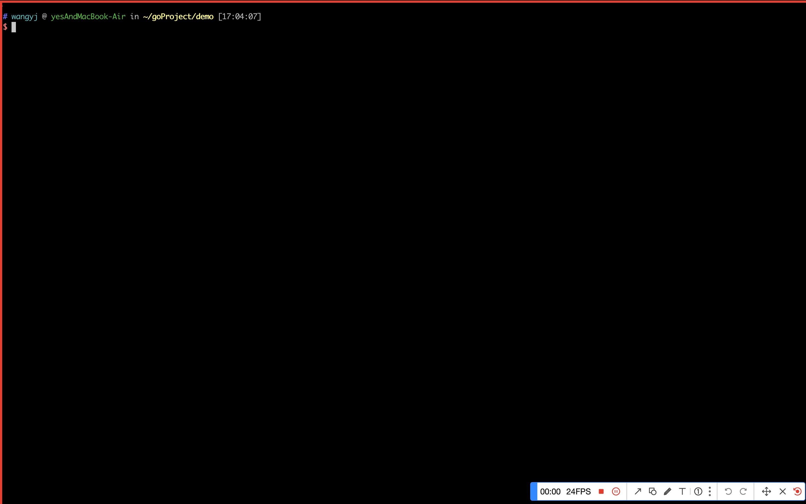
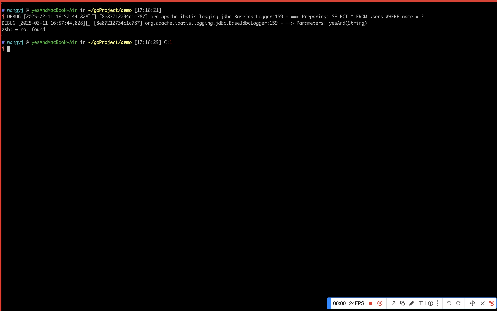

## lwe

lwe是leave work early的缩写，也就是"早点下班"！，早完活，早摸鱼！🤣🤣🤣
它是一个帮助开发者提高工作效率的跨平台命令行工具，当然你把它当做go入门学习的项目也是合适的！
总之，欢迎提issue、提好玩或者使用的功能需求，最好能直接PR参与到项目中。 💪💪💪

## 功能

增强Git命令，跨多仓库操作以及AI辅助能力

- [gcmsg ai生成提交信息](#gcmsg)
- [glog 增强Git日志功能](#glog)
- [gl 增强拉取代码功能](#gl)
- [gcl 增强git clone功能](#gcl)
- [gst 查看指定目录下所有git仓库状态](#gst)

[解析mybaits的SQL输出日志，生成替换参数后的可执行SQL](#sqllog)

[由建表SQL语句转换成Java Bean、Go结构体、Json等文件](#fmt)

[其它小工具](#other)

- 获取Navicat连接配置中的密码
- 同步两个目录下文件
- 显示本机配置的环境变量
- 静态资源代理

## 安装

### 下载编译后的可执行文件

到[release](https://github.com/yesAnd92/lwe/releases)页获取对应平台的版本，在终端上即可使用该二进制文件！

当然，更推荐的方式是将二进制文件配置到环境变量中，这样可以随时随地使用二进制文件

更多的安装方式和注意事项，查查阅[Wiki](https://github.com/yesAnd92/lwe/wiki/0.%E5%AE%89%E8%A3%85%E3%80%81%E9%85%8D%E7%BD%AE%E4%BD%BF%E7%94%A8)

## AI 配置说明

如果使用的需要依赖ai能力，需要配置ai相关参数。

### 配置文件位置

- Linux/Mac: `$HOME/.config/lwe/config.yml`
- Windows: `%USER%\.config\lwe\config.yml`

### 示例配置

可以将源码config/config_template.yml 复制一份，然后修改为自己的配置放到对应上述指定目录下即可

```yaml
ai:
    name: siliconflow                                           # AI 服务提供商
    apikey: your_api_key                                        # 您的 API 密钥
    baseurl: https://api.siliconflow.cn/v1/chat/completions     # API 接口地址
    model: Qwen/Qwen2.5-Coder-32B-Instruct                      # 模型名称

```

> 1.目前仅支持siliconflow、deepseek
>
> 2.条件允许下，推荐使用更"智能"的模型，体验更好

## 使用

你可以输入`lwe` 查看lwe命令的使用方式，有哪些子命令及其各自对的功能描述。

如果对某个子命令感兴趣，可以使用`-h`参数查看命令的使用示例 ，如：`lwe glog -h`

<h3 id="gcmsg" >gcmsg ai生成提交信息</h3>

`gcmsg` (Git Commit Message) 是一个借助 AI 能力生成 Git 提交信息的命令。它能够分析当前的代码变更，并生成合适的提交信息，然后自动完成提交和推送操作。**此命令需要配置AI相关参数**

使用方式：
在git仓库下

```text
lwe gcsmg 
```

示例：


#### 注意事项

> 1.大量文件提交时，不要使用此命令，不仅消耗token量大，也很容易超时
> 2.敏感数据有暴露到公网的风险，使用时注意甄别

<h3 id="glog" >glog 增强Git日志功能</h3>

`glog` (Git Log)查看给定**目录下所有git仓库**提交日志
开发人员通常会在多个git仓库下工作，经常会有同时查看多个git仓库提交日志的需求，glog子命令就派上用场了。

使用方式：

```text
lwe glog [git repo dir] [-a=yesAnd] [-n=50] [-s=2023-08-04] [-e=2023-08-04]
```

示例：


<h3 id="gl" >gl 增强拉取代码功能</h3>

`gl` (Git Pull)拉取给定**目录下的所有git仓库**最新代码(使用的git pull --rebase的方式)

使用方式：

```text
lwe gl [git repo dir]
```

详细使用说明，可以查阅[Wiki](https://github.com/yesAnd92/lwe/wiki/3.Git%E5%A2%9E%E5%BC%BA%E5%8A%9F%E8%83%BD#gl-%E6%8B%89%E5%8F%96%E6%8C%87%E5%AE%9A%E7%9B%AE%E5%BD%95%E4%B8%8B%E6%89%80%E6%9C%89git%E4%BB%93%E5%BA%93https://github.com/yesAnd92/lwe/wiki/3.Git%E5%A2%9E%E5%BC%BA%E5%8A%9F%E8%83%BD#gcl-%E5%85%8B%E9%9A%86%E6%95%B4%E4%B8%AAgroup%E4%B8%8B%E7%9A%84%E6%89%80%E6%9C%89git%E4%BB%93%E5%BA%93https://github.com/yesAnd92/lwe/wiki/1.%E5%BB%BA%E8%A1%A8SQL%E8%AF%AD%E5%8F%A5%E7%94%9F%E6%88%90%E4%B8%8D%E7%94%A8%E8%AF%AD%E8%A8%80%E6%89%80%E9%9C%80%E5%AE%9E%E4%BD%)

<h3 id="gcl" >gcl 增强git clone功能</h3>

`gcl` (Git clone) 可以拉取**group**下所有的git仓库,适用group下git仓库拉取数量多的场景

使用方式：

```text
lwe gcl gitGroupUrl [dir for this git group] -t=yourToken
```

详细使用说明，可以查阅[Wiki](https://github.com/yesAnd92/lwe/wiki/3.Git%E5%A2%9E%E5%BC%BA%E5%8A%9F%E8%83%BD#gcl-%E5%85%8B%E9%9A%86%E6%95%B4%E4%B8%AAgroup%E4%B8%8B%E7%9A%84%E6%89%80%E6%9C%89git%E4%BB%93%E5%BA%93https://github.com/yesAnd92/lwe/wiki/1.%E5%BB%BA%E8%A1%A8SQL%E8%AF%AD%E5%8F%A5%E7%94%9F%E6%88%90%E4%B8%8D%E7%94%A8%E8%AF%AD%E8%A8%80%E6%89%80%E9%9C%80%E5%AE%9E%E4%BD%9)

<h3 id="gst" >gst 查看指定目录下所有git仓库状态</h3>

查看给定目录下的所有git仓库状态

使用方式：

```text
lwe gst [your git repo dir]
```

---

<h3 id="sqllog">解析Mybatis的SQL输出日志,生成替换参数后的可执行SQL</h3>

Mybatis输出的日志，SQL语句和参数是分开的，调试SQL时，需要粘出来再去用参数替换对应的占位符，比较繁琐。这个命令可以快速解析出一个填充参数后的可执行SQL。

```bash
lwe sqllog <mybatis sql log> 
```

使用示例：


#### 注意事项

- 确保输出的日志包含 "Preparing:" 和 "Parameters:" 两个部分。
- 在将 SQL 日志作为参数传递时，确保用双引号将整个 SQL 日志括起来。

---

<h3 id="fmt">建表语句生成Java Bean实体、Go 结构体等</h3>

如果我们已经有了表结构，使用建表语句生成对应的实体可以大大减少我们"无脑且重复"工作。
目前支持生成的结构包括Java、Go、Json。

使用方式：

```text
lwe fmt sql-file-path [-t=java|go|json] [-a=yesAnd]
```

详细使用说明，可以查阅[Wiki](https://github.com/yesAnd92/lwe/wiki/1.%E5%BB%BA%E8%A1%A8SQL%E8%AF%AD%E5%8F%A5%E7%94%9F%E6%88%90%E4%B8%8D%E7%94%A8%E8%AF%AD%E8%A8%80%E6%89%80%E9%9C%80%E5%AE%9E%E4%BD%93)

---

<h3 id="other">其它小工具</h3>
一些非常实用的功能

<h4>获取Navicat连接配置中的密码</h4>
如果想从Navicat保存的连接中获取对应数据库的用户名/密码，可以使用ncx文件，ncx文件是Navicat导出的连接配置文件，但ncx中的密码是一个加密后的十六进制串，使用ncx命令可以获取对应的明文

使用方式：

```text
lwe ncx ncx-file-path
```

详细使用说明，可以查阅[Wiki](https://github.com/yesAnd92/lwe/wiki/%E5%85%B6%E5%AE%83%E5%B0%8F%E5%B7%A5%E5%85%B7#%E8%8E%B7%E5%8F%96navicat%E8%BF%9E%E6%8E%A5%E9%85%8D%E7%BD%AE%E4%B8%AD%E7%9A%84%E5%AF%86%E7%A0%81)

<h4>同步两个目录下文件</h4>
如果你有备份文件的习惯，这个工具可能会帮到你，它可以将源目录文件下的新增的文件同步到备份目录，省去了你逐层文件夹逐个文件去手动同步。

使用方式：

```text
lwe fsync sourceDir targetDir [-d=true]
```

详细使用说明，可以查阅[Wiki](https://github.com/yesAnd92/lwe/wiki/%E5%85%B6%E5%AE%83%E5%B0%8F%E5%B7%A5%E5%85%B7#%E5%90%8C%E6%AD%A5%E4%B8%A4%E4%B8%AA%E7%9B%AE%E5%BD%95%E4%B8%8B%E6%96%87%E4%BB%B6)

<h4>静态资源代理</h4>
可以为静态资源提供代理，方便本地访问测试

使用方式：

```text
lwe fileserver your-file-dir [-p=8080]
```

详细使用说明，可以查阅[Wiki](https://github.com/yesAnd92/lwe/wiki/%E5%85%B6%E5%AE%83%E5%B0%8F%E5%B7%A5%E5%85%B7#%E9%9D%99%E6%80%81%E8%B5%84%E6%BA%90%E4%BB%A3%E7%90%86)

## 声明

1.使用[spf13/cobra](github.com/spf13/cobra)库来方便的构建命令行工具

2.es子命令实现借助了[sqlparser](github.com/xwb1989/sqlparser)库来解析SQL语句，一个库很优秀的解析SQL库

3.sql转换成dsl，曹大的[elasticsql](https://github.com/cch123/elasticsql)项目已经是一个很成熟好用的轮子了，lwe也大量借鉴了它的实现思路；没直接调用这个库的原因是想自己练手，同时后续增减功能也更加灵活

4.git增强命令结果输出时使用了[go-pretty](https://github.com/jedib0t/go-pretty)库来表格化提交信息

5.gcmsg命令接入ai时，借鉴了[aicmt](https://github.com/versun/aicmt)如何写prompt，`aicmt`是个功能更强大ai辅助的git提交的工具

## 开源协议

[MIT License](https://github.com/yesAnd92/lwe/blob/main/LICENSE)
